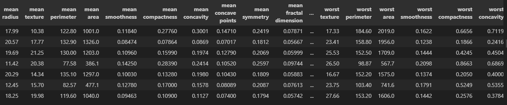
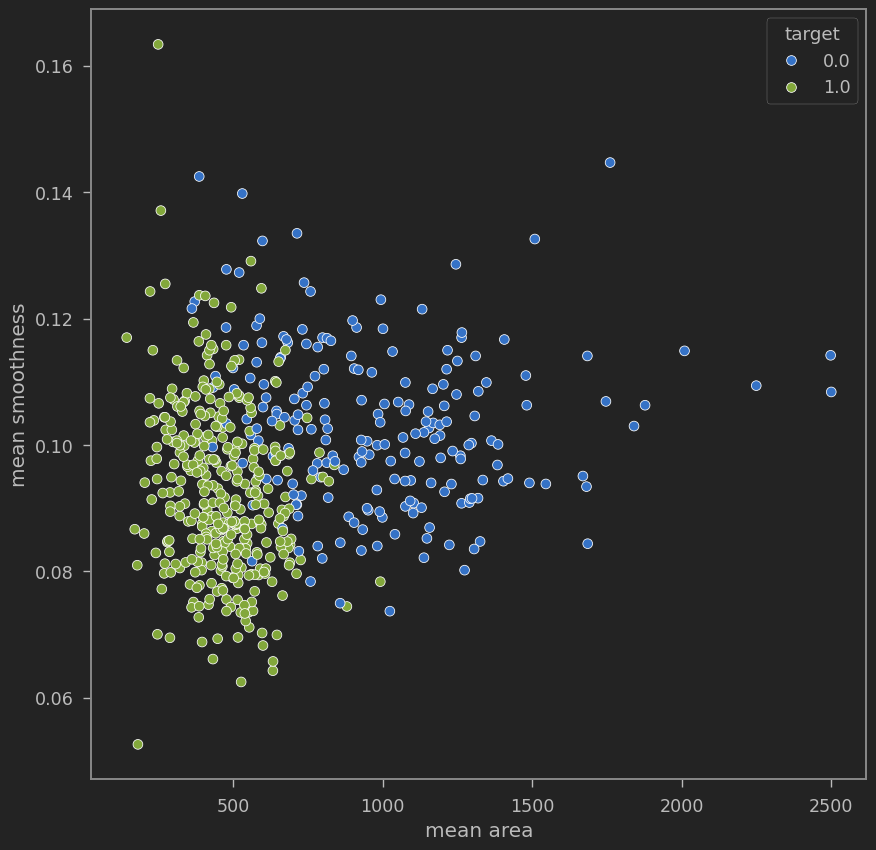
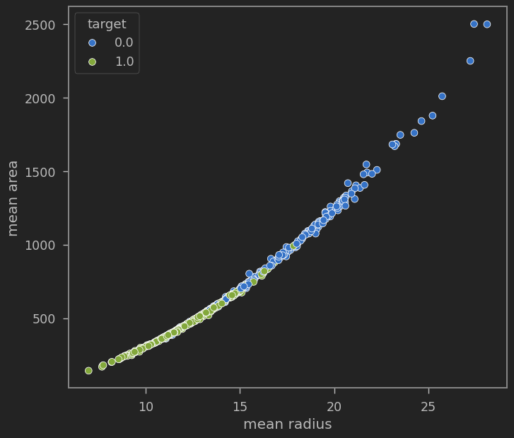
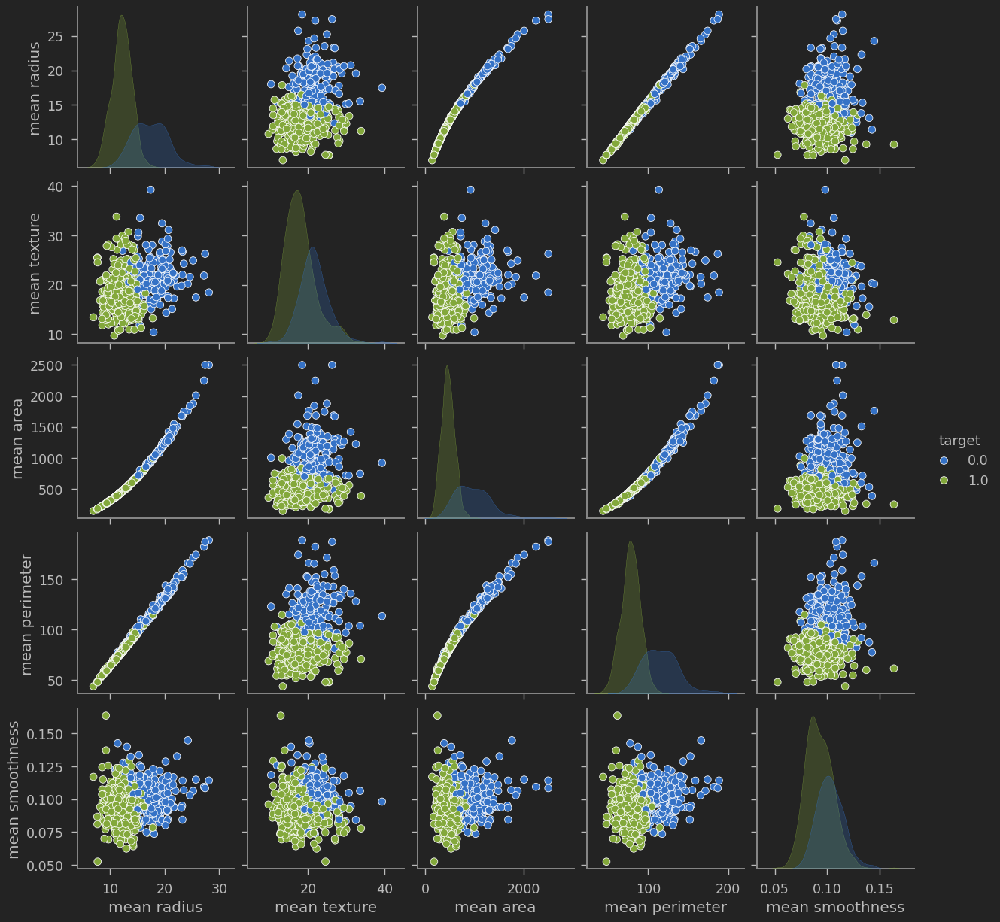
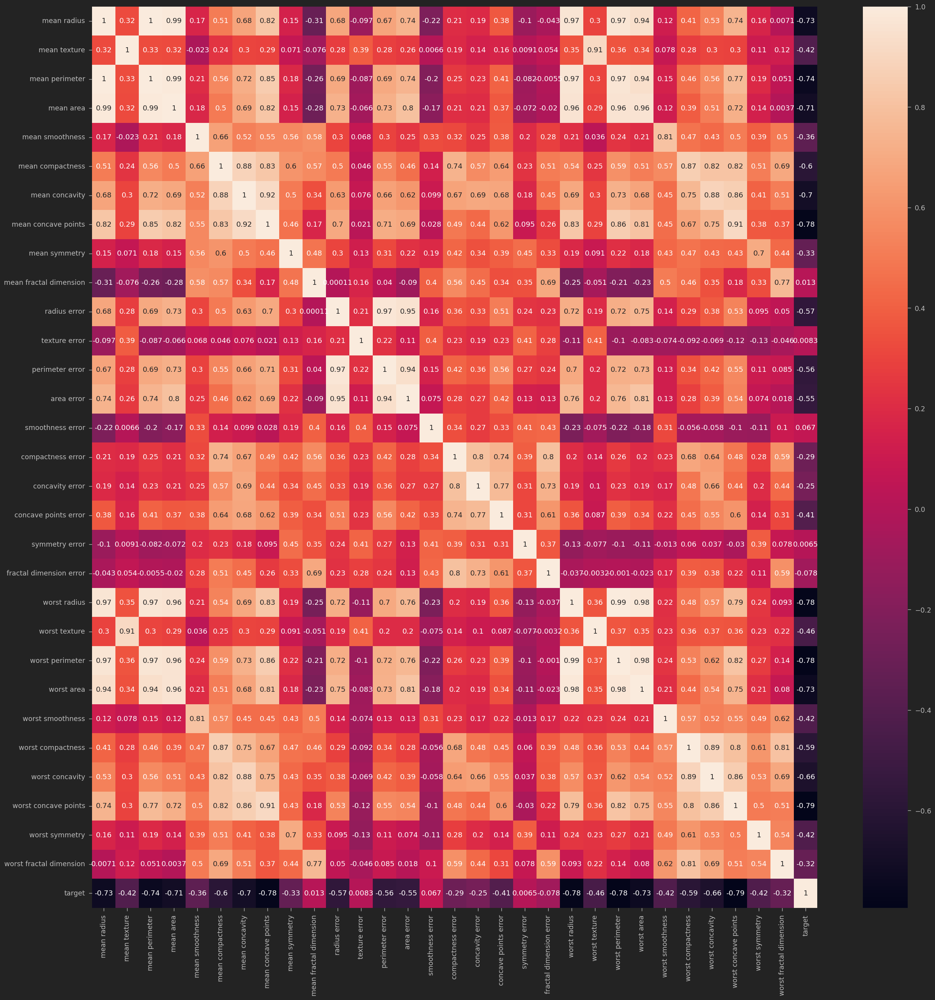
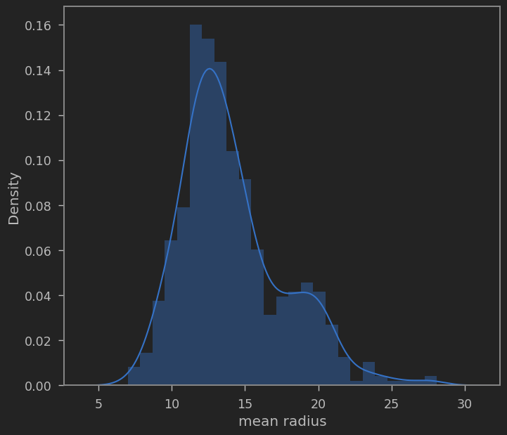
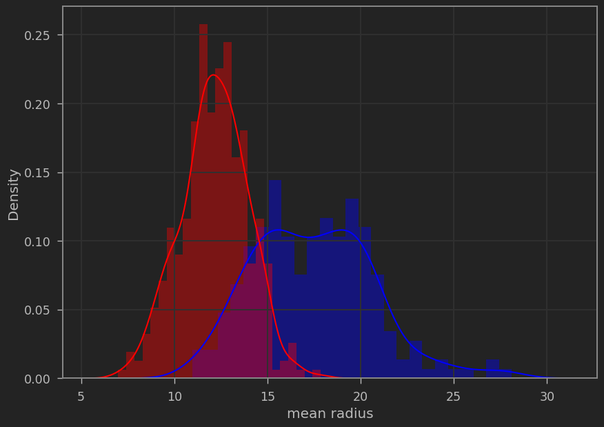

# Breast Cancer Data Exploration and Classification

## Objective
Explore and analyze the breast cancer dataset using statistical techniques and machine learning models to predict the presence of malignant or benign tumors.

## Project Description
This project uses a well-known dataset from the sklearn library to understand the relationships between features associated with breast cancer diagnoses. The goal is to identify important indicators of malignancy and build a predictive classification model to assist in early cancer detection.

## Installation
Required packages can be installed using:
```bash
pip install pandas numpu matplotlib seaborn sklearn
```

## Dataset
**Source:** Built-in dataset from `sklearn.datasets.load_breast_cancer()`  
**Features Include:**  
- Mean, standard error, and worst values for attributes like radius, texture, perimeter, area, smoothness, compactness, concavity, and symmetry  
- Target: `0` = malignant, `1` = benign



## Methodology
- Loaded and structured the dataset from sklearn  
- Performed exploratory data analysis (EDA) to visualize feature distributions and correlations  
- Used pair plots, heatmaps, and boxplots for EDA  
- Applied feature scaling and PCA for dimensionality reduction  
- Built and evaluated classification models such as:
  - Logistic Regression  
  - Support Vector Machine  
  - Random Forest  
- Evaluated performance using accuracy, precision, recall, F1-score, and confusion matrices  

## Results
You can see from the graph that the malignant cells are typically larger in mean area compared to benign cells



A scatterplot between mean area and mean radius shows that as mean radius increases, mean area increases 
Also, class #0 (Malignant) generally has larger mean radius and mean area compared to class #1 (Benign).



Then we can take any amount of variables and use a pairplot to graph those variables against eachother. 
We can see that many of these features are correlated. 



To see how closely correlated these features are, we can use a heatmap



We can graph a distplot to plot the probability density of the continuous variable, 'mean radius'



Now we can make new dataframes from the dataset where one contains the entries where the target=0, and one where the target=1.
With this, we can plot the two together and we can see that class 0 typically has larger cells, while class 1 cells are smaller. 




